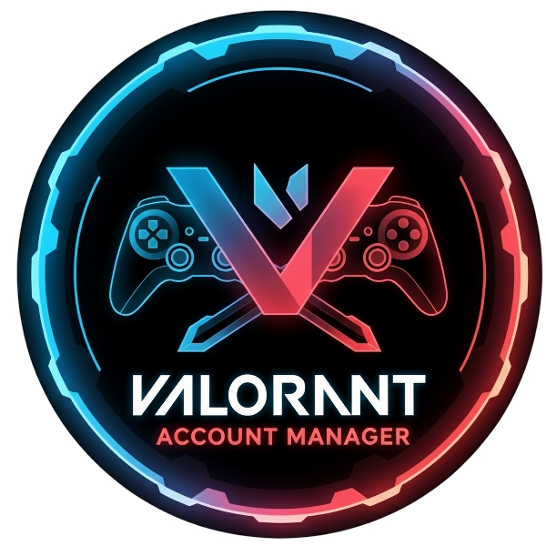

# Valorant Account Manager & Rank Finder

A secure, cross-platform desktop application for managing multiple Valorant accounts with real-time rank tracking. Built with Electron, React, TypeScript, and styled-components.



## 🌍 Cross-Platform Support

**Available for all major operating systems:**

| Platform | File Types | Architectures | Status |
|----------|------------|---------------|--------|
| 🪟 **Windows** | `.exe` installer | x64 | ✅ Ready |
| 🍎 **macOS** | `.dmg`, `.zip` | Intel + Apple Silicon (M1/M2) | ✅ Ready |
| 🐧 **Linux** | `.AppImage`, `.deb`, `.rpm` | x64 | ✅ Ready |

## ✨ Features

### 🔐 Security
- **Master Password Protection**: All data encrypted with AES-256-CBC using PBKDF2 key derivation (100K iterations)
- **Per-User Salt**: Unique cryptographic salt per installation prevents rainbow table attacks
- **Local Storage Only**: Your data never leaves your computer

### 🎮 Account Management
- **Account CRUD**: Add, edit, delete Valorant accounts with Riot ID#Tag, username, password, region, and notes
- **🏷 Tags & Groups**: Categorize accounts with custom tags (e.g., "smurf", "main", "EU alts")
- **Filter by Tag**: Quick filter accounts by any tag
- **👤 Lending Tracker**: Mark accounts as lent out with borrower name and date
- **📁 Import/Export**: Import from JSON/CSV files, export all accounts to CSV
- **📊 Statistics Dashboard**: Total accounts, skin coverage, region distribution, rank distribution

### 🏆 Rank Tracking
- **Dual API Support**: Uses [HenrikDev API](https://api.henrikdev.xyz) (with API key) for rich data; falls back to basic rank fetching without a key
- **📈 Rank History**: Bar chart visualization of rank progression over time
- **🔝 Peak Rank Tracking**: Records highest rank achieved per account
- **Rank Icons**: Beautiful rank badge display for all 23 competitive tiers (Iron → Radiant)
- **Auto-Refresh**: Optional scheduled rank refresh at configurable intervals
- **Bulk Refresh**: Refresh ranks for selected accounts or all at once

### 🖥️ User Experience
- **⌨️ Keyboard Shortcuts**: Full keyboard navigation — `Ctrl+F` search, `Ctrl+N` new account, `Ctrl+R` refresh all, `?` for help
- **✅ Bulk Operations**: Multi-select accounts for bulk delete, tag, or refresh
- **📋 Compact View**: Toggle between standard and dense layouts
- **🔲 List/Grid Views**: Switch between table and card layouts
- **🔍 Search & Filter**: Search by Riot ID or username, filter by tag or lending status
- **🌓 Dark/Light Theme**: Full theme system with Valorant red (#FF4655) accent
- **🔄 System Tray**: Minimize to tray, quick access context menu
- **💾 Persistent Preferences**: View layout, sort order, compact mode remembered across sessions
- **📱 Share Modal**: Share account details via WhatsApp, Telegram, Discord, Twitter, email, or clipboard
- **🔄 Auto-Updates**: Professional update system with download progress and restart prompt

### 🌍 Multi-Region Support
BR, AP, EU, KR, LATAM, NA

## 🚀 Installation

### Option 1: Download Pre-built Executable (Recommended)

**Download the latest release for your platform:**

#### 🪟 Windows
- **[Valorant Account Manager Setup.exe](https://github.com/nisarganag/Valorant-Account-Manager-and-Rank-Finder/releases/latest)**
  - Full installer with shortcuts and auto-updater
  - Supports Windows 10/11 (x64)

#### 🍎 macOS
- **[Valorant Account Manager.dmg](https://github.com/nisarganag/Valorant-Account-Manager-and-Rank-Finder/releases/latest)**
  - Universal binary (Intel + Apple Silicon)
  - Drag-and-drop installation
- **[Valorant Account Manager.zip](https://github.com/nisarganag/Valorant-Account-Manager-and-Rank-Finder/releases/latest)**
  - Portable app bundle version

#### 🐧 Linux
- **[Valorant Account Manager.AppImage](https://github.com/nisarganag/Valorant-Account-Manager-and-Rank-Finder/releases/latest)**
  - Universal Linux binary (recommended)
  - No installation required - just download and run
  - Works on any Linux distribution
- **[valorant-account-manager.deb](https://github.com/nisarganag/Valorant-Account-Manager-and-Rank-Finder/releases/latest)**
  - For Debian/Ubuntu systems: `sudo dpkg -i valorant-account-manager*.deb`
- **[valorant-account-manager.rpm](https://github.com/nisarganag/Valorant-Account-Manager-and-Rank-Finder/releases/latest)**
  - For RedHat/Fedora systems: `sudo rpm -i valorant-account-manager*.rpm`

### Platform-Specific Notes

#### 🪟 Windows Installation
1. Download the `.exe` installer
2. Run as administrator if needed
3. Follow the installation wizard
4. Desktop and start menu shortcuts are created automatically

#### 🍎 macOS Installation
1. Download the `.dmg` file
2. Open the disk image
3. Drag the app to Applications folder
4. Right-click and "Open" first time (security requirement)

#### 🐧 Linux Installation
**AppImage (Recommended):**
```bash
# Make executable and run
chmod +x Valorant-Account-Manager*.AppImage
./Valorant-Account-Manager*.AppImage
```

**Debian/Ubuntu:**
```bash
sudo dpkg -i valorant-account-manager*.deb
# If missing dependencies:
sudo apt-get install -f
```

**RedHat/Fedora:**
```bash
sudo rpm -i valorant-account-manager*.rpm
# Or with DNF:
sudo dnf install valorant-account-manager*.rpm
```

> **✨ Auto-Updates**: All versions include automatic update capabilities to keep you current with the latest features and security improvements.

### Option 2: Build from Source

#### Prerequisites
- [Node.js](https://nodejs.org/) (v18 or higher)
- [Git](https://git-scm.com/)

#### Steps

1. **Clone the repository**
   ```bash
   git clone https://github.com/nisarganag/Valorant-Account-Manager-and-Rank-Finder.git
   cd Valorant-Account-Manager-and-Rank-Finder
   ```

2. **Install dependencies**
   ```bash
   npm install
   ```

3. **Run in development mode** (optional)
   ```bash
   npm run electron-dev
   ```

4. **Build for your platform**
   ```bash
   npm run build:win    # Windows
   npm run build:mac    # macOS (requires macOS)
   npm run build:linux  # Linux (requires Linux)
   ```

5. **Find your built application** in the `dist-electron` folder

## ⌨️ Keyboard Shortcuts

| Shortcut | Action |
|----------|--------|
| `Ctrl+F` | Focus search bar |
| `Ctrl+N` | New account |
| `Ctrl+R` | Refresh all ranks |
| `Ctrl+Shift+I` | Toggle import panel |
| `Ctrl+Shift+S` | Toggle statistics |
| `Ctrl+Shift+E` | Export accounts to CSV |
| `Ctrl+Shift+G` | Toggle list/grid view |
| `Ctrl+Shift+C` | Toggle compact mode |
| `Escape` | Close all modals / deselect |
| `?` | Show keyboard shortcuts |

## 📖 Usage

### First Time Setup

1. **Create Master Password**: On first launch, create a master password. This encrypts all your account data.
2. **API Key (Optional)**: Click the "Not Set" badge in the settings bar and paste a [HenrikDev API key](https://api.henrikdev.xyz/dashboard) for richer rank data (rank icons, RR, history).
3. **Add Accounts**: Click "Add New Account" or press `Ctrl+N`:
   - **Riot ID#Tag**: Your Valorant display name with tag (e.g., `PlayerName#1234`)
   - **Login Username**: Your Riot account username
   - **Password**: Your account password
   - **Region**: Select your game region
   - **Tags**: Add custom tags like "smurf", "main", "EU alts"
   - **Lent To**: Track who borrowed the account
4. **Fetch Ranks**: Ranks auto-fetch on startup, or use the refresh buttons

### Account Management

- **Edit/Delete**: Use the action buttons on each row
- **Bulk Operations**: Check the boxes to select multiple accounts, then use the action bar
- **Tags**: Add tags when creating/editing accounts, or use the Tag Manager (`🏷 Manage Tags`)
- **Lending**: Enter a name in the "Lent To" column to track borrowed accounts
- **Import**: Use 📁 Import to load accounts from JSON/CSV files

### Views & Layout

- **List/Grid Toggle**: Switch between table and card layouts
- **Compact Mode**: `Ctrl+Shift+C` for a denser view with more rows on screen
- **Statistics**: 📊 button shows totals, region distribution, and rank breakdown

## 🔒 Security

- **PBKDF2 Key Derivation**: Encryption key derived from master password with 100,000 iterations and unique salt
- **AES-256-CBC Encryption**: All account credentials encrypted with random IV per save
- **Master Password**: Stored as SHA-256 hash only
- **Local Storage**: All data stored locally on your machine
- **No Cloud Sync**: Your data never leaves your computer

## 🛠️ Tech Stack

- **Frontend**: React 19, TypeScript, styled-components
- **Desktop Framework**: Electron 38+ with auto-updater
- **Build Tool**: Vite with Rolldown bundler
- **Cross-Platform Builds**: electron-builder with GitHub Actions
- **Encryption**: CryptoJS (AES-256-CBC with PBKDF2)
- **Rank API**: HenrikDev API (primary) + fallback API
- **Package Manager**: npm
- **CI/CD**: GitHub Actions matrix builds (Windows, macOS, Linux)

## 📁 Project Structure

```
Valorant-Account-Manager-and-Rank-Finder/
├── electron/                    # Electron main process
│   ├── main.js                  # Main process, IPC handlers, tray
│   └── preload.js               # Context bridge for secure IPC
├── src/
│   ├── components/              # React components
│   │   ├── AccountForm.tsx      # Add/edit account form with tags & lending
│   │   ├── AccountTable.tsx     # Table view with bulk select, sorting
│   │   ├── AccountGrid.tsx      # Card grid view
│   │   ├── AccountStatistics.tsx # Stats dashboard
│   │   ├── BulkActionBar.tsx    # Multi-select action toolbar
│   │   ├── FileUpload.tsx       # JSON/CSV import
│   │   ├── KeyboardShortcutsHelp.tsx # Shortcuts reference overlay
│   │   ├── MasterPasswordDialog.tsx  # Auth gate
│   │   ├── RankHistoryPanel.tsx # Rank history chart with peak tracking
│   │   ├── SearchBar.tsx        # Search input
│   │   ├── TagManager.tsx       # Tag management for all accounts
│   │   ├── ThemeToggle.tsx      # Dark/light mode switch
│   │   ├── UpdateManager.tsx    # Auto-update notification UI
│   │   └── ViewToggle.tsx       # List/grid layout toggle
│   ├── services/
│   │   └── rankService.ts       # Dual-API rank fetching (HenrikDev + legacy)
│   ├── utils/
│   │   └── encryption.ts        # PBKDF2 + AES-256-CBC encryption
│   ├── contexts/
│   │   ├── ThemeContext.tsx      # Theme state provider
│   │   └── useTheme.ts          # Theme hook
│   ├── types/                   # TypeScript type definitions
│   └── theme/                   # Dark and light theme definitions
├── public/icons/                # Rank badges and app icons
├── build/                       # Platform-specific build assets
├── examples/                    # Example import files (JSON/CSV)
├── .github/workflows/           # CI/CD — matrix builds on tag push
└── package.json
```

## 🚀 Automated Release System

### Release Process

```powershell
.\scripts\release.ps1 -Type patch -Message "Bug fixes and improvements"
.\scripts\release.ps1 -Type minor -Message "New features and enhancements"
.\scripts\release.ps1 -Type major -Message "Breaking changes and major updates"
```

### What Happens Automatically

1. **Version Management**: Bumps version in package.json
2. **Git Operations**: Creates commits and tags
3. **Cross-Platform Builds**: GitHub Actions builds on 3 OS simultaneously
4. **Release Creation**: Creates GitHub release with all platform files
5. **Auto-Update Distribution**: Updates available to all users instantly

## 🤝 Contributing

Contributions are welcome! Please feel free to submit a Pull Request.

1. Fork the repository
2. Create your feature branch (`git checkout -b feature/AmazingFeature`)
3. Commit your changes (`git commit -m 'Add some AmazingFeature'`)
4. Push to the branch (`git push origin feature/AmazingFeature`)
5. Open a Pull Request

## 📝 License

This project is open source and available under the [MIT License](LICENSE).

## 👤 Author

**Nisarga**
- GitHub: [@nisarganag](https://github.com/nisarganag)

## 🙏 Acknowledgments

- **Riot Games**: For Valorant rank icons and game data
- **[HenrikDev API](https://api.henrikdev.xyz)**: Rank, MMR history, and match data
- **Electron**: Cross-platform desktop framework
- **GitHub Actions**: Automated cross-platform builds
- **Open Source Community**: For the amazing tools and libraries

---

**🌍 Cross-Platform • 🔒 Secure • ⚡ Fast**
**Made with ❤️ by [Nisarga](https://github.com/nisarganag) for the Valorant community**
